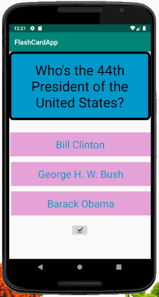

# FlashCardUI-CodePath-Lab1

## FlashCardUI_CodePath_Lab1

📝 `NOTE:` Paste the README templates for each subsequent lab here at the top, (i.e. lab 2, 3, 4). This will show a history of your development process including which users tories you completed and how your app looked and functioned at each step.

## Lab 1

### App Description
📝 `NOTE:` Create a new app project, Add different UI views on a screen, Customizing UI, Understand how to debug crashes and log useful messages, Push project to Github

### App Walk-through

## Required
- [x] Create New Project in Android Studio
- [x] Add a view for the front side of the flashcard to display the question
- [x] Add a view for the back side of the flashcard to display the answer
- [x] Build in logic to show the answer side when the card is tapped
- [x] Push code to GitHub
## Optional
- [x] toggle the flashcard between the question side and the answer side
- [x] Style the question and answer side of the card to better distinguish between the two sides
- [x] Add selectable multiple choice answers beneath the card
   - [x] Change the background color of the multiple choice answers when clicked to indicate whether the question waanswered correctly
- [x] Further customize and style the card
